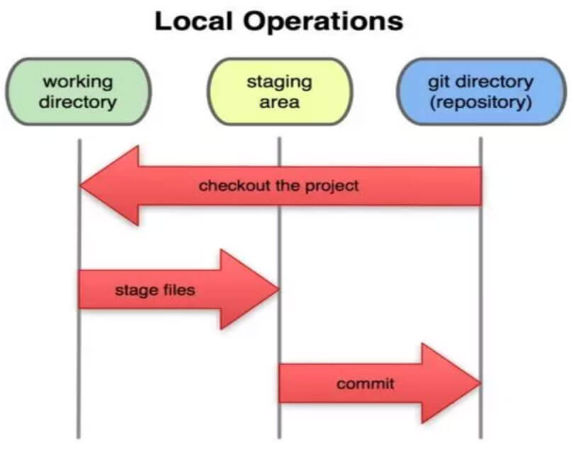
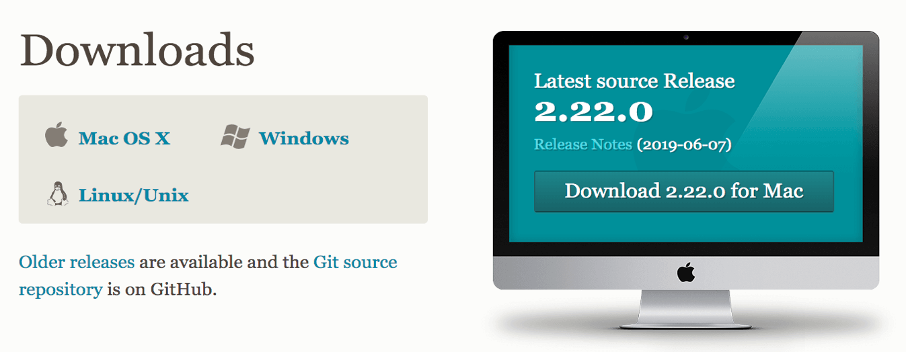
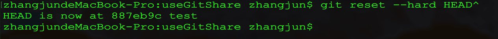
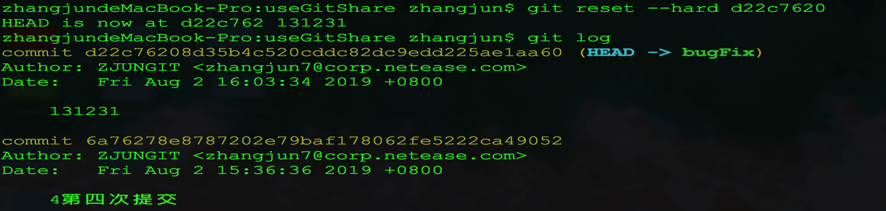
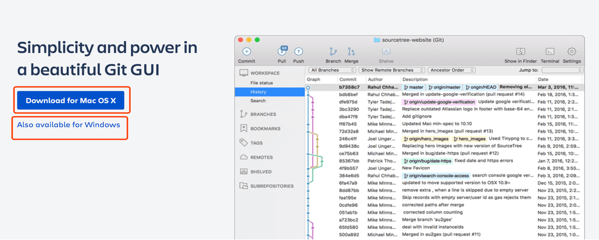

---?color=linear-gradient(180deg, #2e70ba 75%, #2e70ba 25%)
@snap[west h3-white span-50]

### git 使用介绍

@snapend

@snap[east span-50]

@snapend

---

## Git 介绍

- 1.什么是 Git：

  Git 是一款免费的、开源的、分布式的版本控制系统。旨在快速高效地处理无论规模大小的任何软件工程。

- 2.Git 优点

  2.1 版本库本地化，支持离线提交，相对独立不影响协同开发。每个开发者都拥有自己的版本控制库，在自己的版本库上可以任意的执行提交代码、创建分支等行为。

  2.2 更少的“仓库污染”。git 对于每个工程只会产生一个.git 目录，这个工程所有的版本控制信息都在这个目录中，不会像 SVN 那样在每个目录下都产生.svn 目录。

  2.3 把内容按元数据方式存储，完整克隆版本库。所有版本信息位于.git 目录中，它是处于你的机器上的一个克隆版的版本库，它拥有中心版本库上所有的东西，例如标签、分支、版本记录等。

  2.4 支持快速切换分支方便合并，比较合并性能好。在同一目录下即可切换不同的分支，方便合并，且合并文件速度比 SVN 快。

  2.5 分布式版本库，无单点故障，内容完整性好。内容存储使用的是 SHA-1 哈希算法。这能确保代码内容的完整性，确保在遇到磁盘故障和网络问题时降低对版本库的破坏。

---

## Git 文件的三种状态

- 对于任何一个文件，在 Git 内都只有三种状态：已提交（committed） 已修改（modified） 已暂存（staged）

1. 已提交表示该文件已经被安全地保存在本地数据库中了；

2. 已修改表示修改了某个文件，但还没有提交保存；

3. 已暂存表示把已修改的文件放在下次提交时要保存的清单中。

- 文件流转的三个工作区域：Git 的工作目录，暂存区域，以及本地仓库。

---

## Git 基本工作流程

- 在工作目录中修改某些文件。
  对修改后的文件进行快照，然后保存到暂存区域。
  提交更新，将保存在暂存区域的文件快照永久转储到 Git 目录中。
  因此可以从文件所处的位置来判断状态：

1. 如果是 Git 目录中保存着的特定版本文件，就属于已提交状态；
2. 如果作了修改并已放入暂存区域，就属于已暂存状态；
3. 如果自上次取出后，作了修改但还没有放到暂存区域，就是已修改状态。

---

## 下载

- 下载地址： https://git-scm.com/download

---

## 准备工作

1. 检测 git 版本，看看是否真能装成功
   git –version

2. 注册一个自己的 github 账号，以便创建仓库

3. 配置 git

- 1） git config -- global user.name "github 的用户名"
- 2） git config -- global user.email "github 的邮箱

4. 生成秘钥，具体方法如下一页

- cd ~/.ssh
- ssh-keygen -t rsa -C ”github 用户名”
- cat id_rsa.pub // 查看公钥，把公钥招贴到 github 中 Settings---> SSH and GPG keys 中

---

## 创建版本库的两种方式

1. 在本地创建一个仓库，将本地文件推送到远程仓库

- 1）本地创建一个文件夹
- 2）cd /文件夹，做如下操作

> git init // 仓库初始化
> touch README.md // 创建文件
> git add README.md // 将当前目录内的所有文件添加到暂存区，加入跟踪
> git commit -am “注释” //提交到本地库
> git remote add origin https://github.com/用户名/仓库地址 //添加远程仓库
> git push -u origin master //提交到远程仓库

2. 从已有的仓库克隆

- 1）使用 https 传输协议
  > git clone https://github.com/用户名/仓库地址（可以从github上复制仓库地址）
- 2）使用 ssh 传输协议
  > git clone git@github.com:用户名/仓库地址

---

## 基本操作

1. 添加文件到暂存区

- git add <filename> ----提交单个文件
- git add . ----提交所有文件

2. 将暂存区中的内容提交至版本库

- git commit –m ‘代码提交信息’
  注意：一定要使用-m 参数加入注释，认真描述本次的提交具体做了些什么，这对于以后我们查询历史记录非常重要。

3. 对于已经跟踪过的，不是新增的文件可以做如下操作

- git commit –am ‘代码提交信息’
  如果觉得使用暂存区过于繁琐，可以在 commit 时直接使用-a 参数，Git 就会自动把所有已经跟踪过的文件暂存起来一并提交，从而跳过 git add 步骤。

---

4. 添加远程仓库

   > git remote add origin https://github.com/用户名/仓库地址

5. 把版本库的代码提交到远程仓库

   > git push -u origin 分支名称

6. 更新本地仓库到最新的改动

   > git pull

7. 切换分支：
   > git checkout 分支名
8. 检查当前文件状态

   > git status

9. 查看历史

   > git log

10. 查看目前是在那个分支

    > git branch
    > git branch –a //查看所有分支

11. 创建新分支并且切换到新分支

    > git checkout –b 新分支名字

---

12. 合并分支

> git merge 分支名
> 项目中实例：
> git checkout master // 切换到主分支
> git branch // 查看当前的分支是不是 master
> git merge 分支名

13. git remote 命令查看远程仓库的详情

> git remote –v // 列出远程服务器清单

14. 推送代码到远程仓库

> - git push origin 分支名
> - git push –set-upstream origin 分支名 //第一次提交加入--set-upstream 设置跟踪后，以后直接使用 git push 就可以推送了

---

## 版本回退

15. 版本回退

- git reset –hard HEAD^ // 回退到上一个版本
- git reset –hard HEAD^^ // 回退到上上个版本
- git reset –hard HEAD~100 // 回退到 100 个版本 之前

---

## 图形化工具

1. github Desktop：https://desktop.github.com/
2. Sourcetree：https://www.sourcetreeapp.com/

